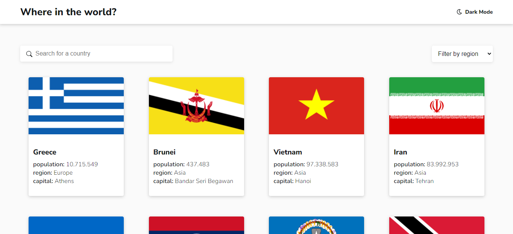
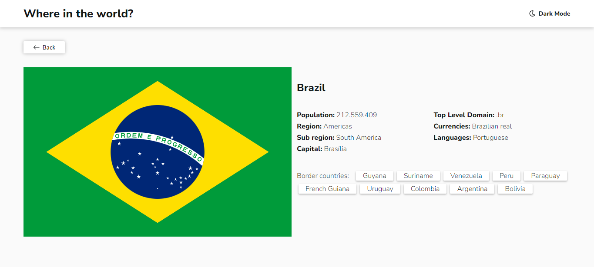
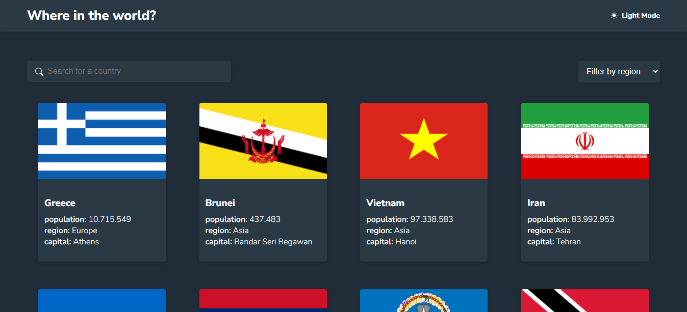
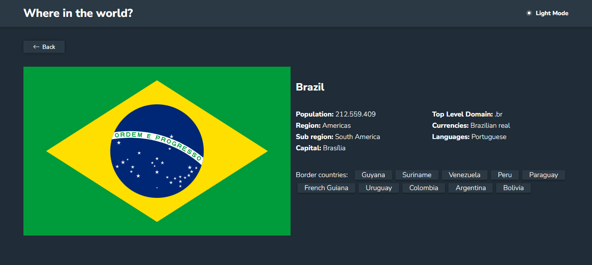
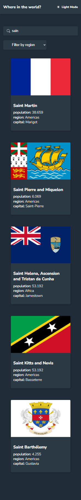
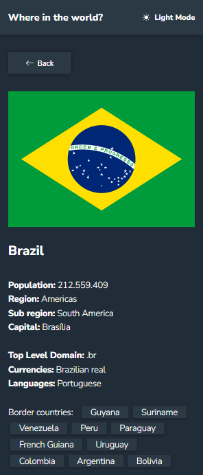
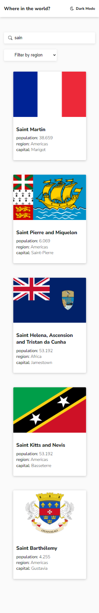
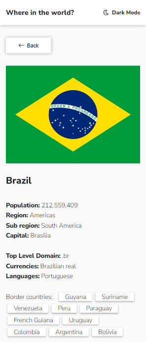

<h1 align="center">
  Encontre informações básicas de qualquer país do mundo 🌎
</h1>
<h1 align="center">
  Where in the world.
</h1>
<br>

## 📖 Informações

<br>

- Este projeto é um desafio do <a href="https://www.frontendmentor.io/home">Front-End Mentor.</a>
- Você vai encontrar informações como: idioma, moeda, capital, população e etc.
- Os dados são fornecidos pela <a href="https://restcountries.com/">Rest countries API</a> em sua versão 3.
- É possível pesquisar pelo nome do país ou filtrar pela região.
- Rest countries é totalmente em inglês portanto, o conteúdo e pesquisas seguem o mesmo padrão.
- Totalmente responsivo e com temas claro e escuro.
<br>
<br>


## 🚀 Tecnologias utilizadas 

<br/>

- ReactJS
- Styled-Components
- React-Router-Dom
- ContextAPI
- Rest API
- Polished

<br>
<br>
<br>

## Screenshots 📸

<p align="center">
    
</p>

<br>

<p align="center">
    
</p>

<br>

<p align="center">
    
</p>

<br>

<p align="center">
    
</p>

<br>

<p align="center">
    
</p>

<br>

<p align="center">
    
</p>

<br>

<p align="center">
    
</p>

<br>

<p align="center">
    
</p>

<br>
<br>
<br>

# 💻 Como rodar/acessar

### Através deste <a href="">link</a> você encontra a versão final do projeto.
<br>

### Para rodar o projeto na sua máquina local:

```bash
# Clonar o repositório
git clone https://github.com/d3vnicolas/countries.git

# acesse o repositorio clonado
cd countries

# instale node-modules 
npm install

# inicie o projeto 
npm start

```
<br>

## 🤗 Contribua comigo<br/>

- Faça um fork desse repositório.
- Marque com star.
- Entre em contato para dúvidas ou sugestões.

<br>
<br>

## 👨🏻‍💻 Desenvolvedor

<table align="center">
    <tr>
        <td align="center">
            <a href="https://github.com/d3vnicolas">
                
            </a>
        </td>    
    </tr>
</table>
<h3 align="center">
   <a href="https://www.linkedin.com/in/nicolas-soares-887655220/" target="_blank"> Nicolas Soares </a>
</h3>
